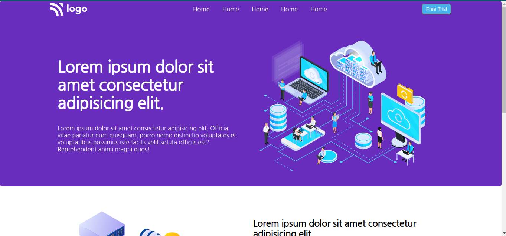
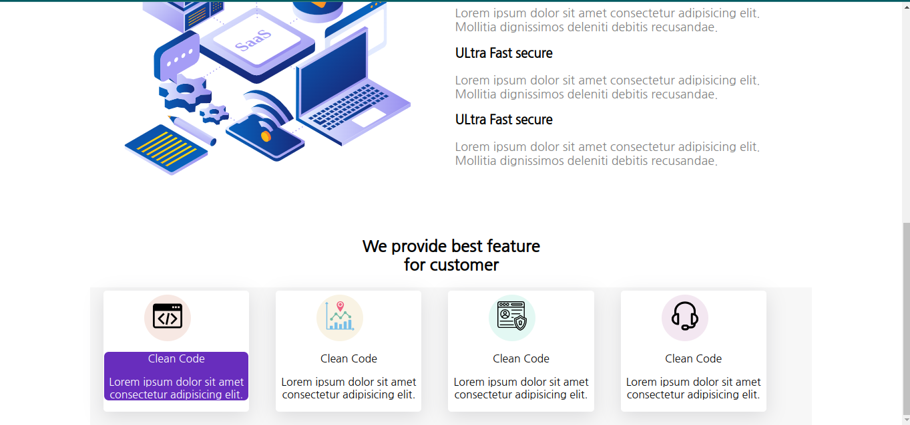
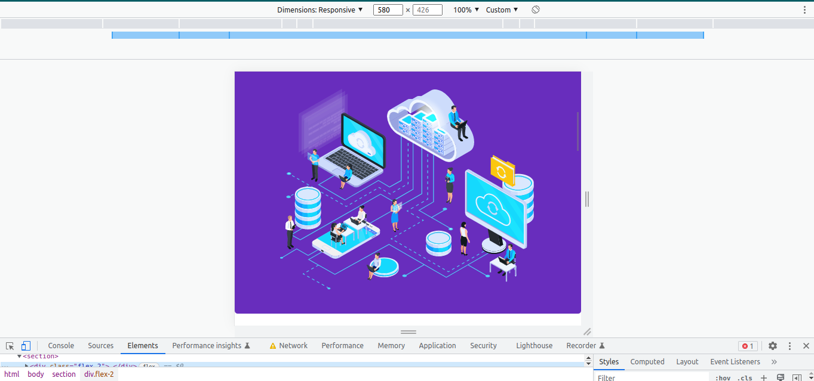
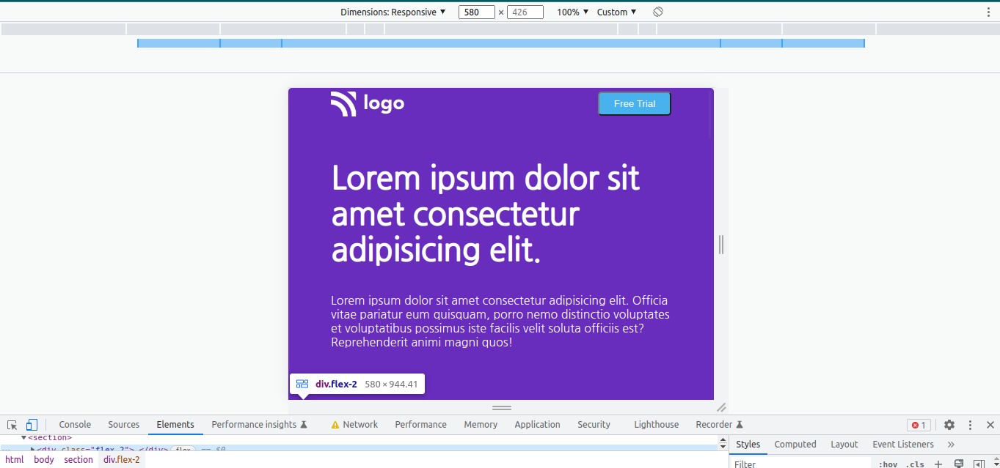
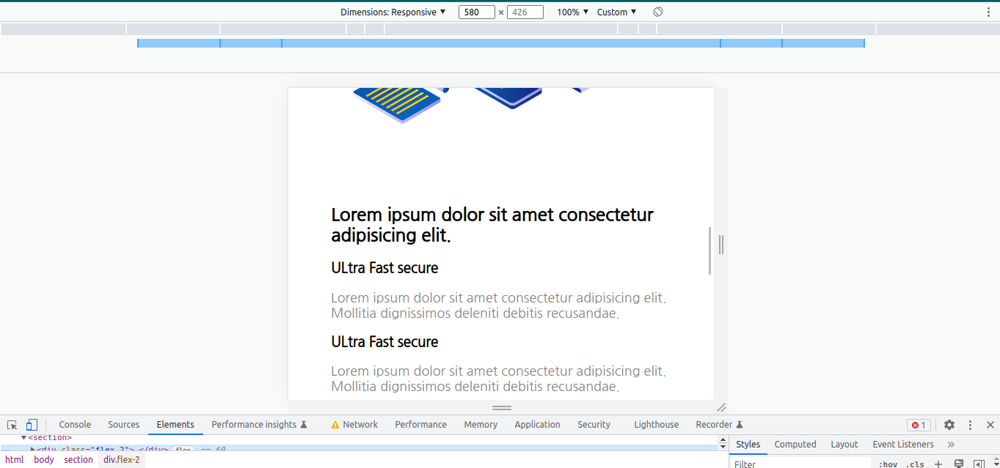
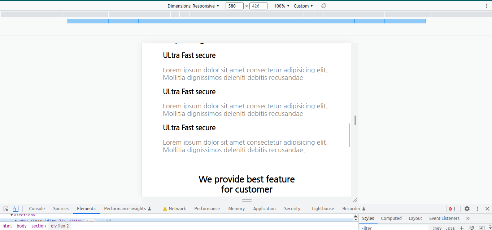
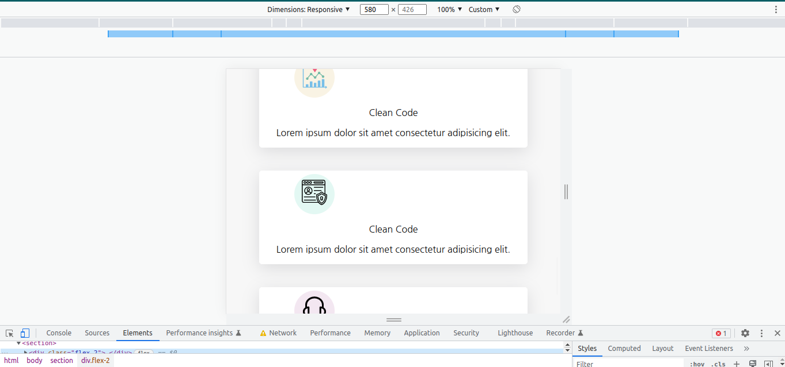
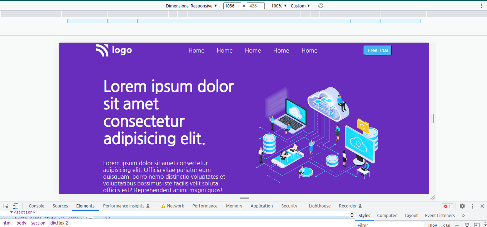
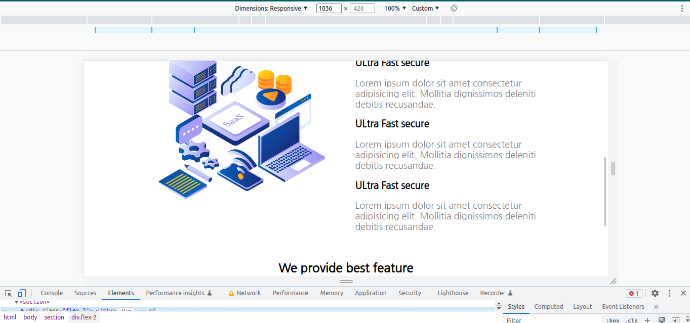

# I am Abhishek Singh
_I am learning Full stack javascript Development_

## This is the assignment that is the part of our live course.
### In this project  I used flex property .
###  The card is  made throgh the grid.
### This is responsive for all screen size

### On the small screen size i used flex-direction : column 


# Project 13
1. SASS Landing page 

# Technology used:
1. ```HTML5```
1. ```CSS3```

# Deployed Link
[Netlify Link](https://sass-landing-pages.netlify.app/)












# Time Taken To Complete This project

_7hours_ 